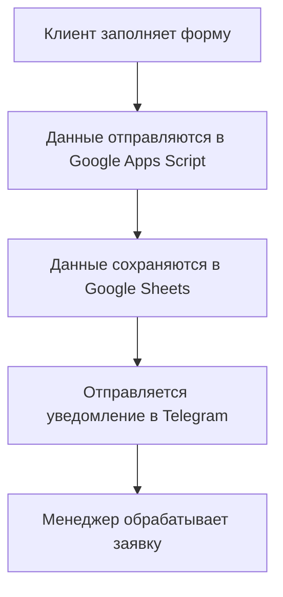

я говорю # Логика обработки заявок для IKEBER

## Обзор системы

Система обработки заявок состоит из следующих компонентов:

1. **Frontend**: HTML форма на сайте IKEBER
2. **Backend**: Google Apps Script для обработки данных
3. **База данных**: Google Sheets для хранения заявок
4. **Уведомления**: Telegram бот для мгновенных оповещений

## Архитектура системы

## Детали реализации

### 1. Frontend (HTML форма)

**Расположение**: [`index.html`](index.html:597-671)

**Поля формы:**
